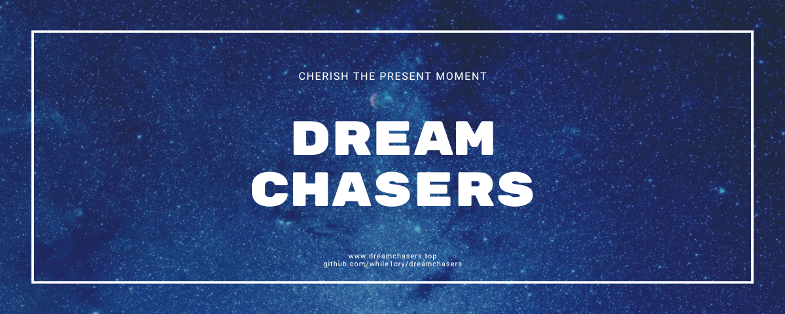

  <h1>DreamChasers（梦想驿站）</h1>
  

## 项目简介

🎉 亲爱的逐梦班同学们，欢迎来到程序员的世界！💻 这个项目是我们班级梦想和回忆汇聚的地方，它如同一根纽带，为我们所有精彩的项目提供坚实的后盾。这里承载着我们共同的心愿和努力，连接着以下几个特别的项目：

- **[dreamchasers.top](https://dreamchasers.top)**：梦想驿站——这里永远是我们心灵的避风港。🌟
- **[SoulGlow App](./soulglow/README.md)**：心语灯——班级的电脑趣味功能桌面应用。💡

每一个项目都在诉说着我们的故事，每一个功能都是我们共同奋斗的见证。

## 模块简介

- **[client（网页端）](./client/README.md)**
> DreamChasers-Client 包含了 [梦想驿站](https://dreamchasers.top) 的网页端
- **[server（服务端）](./server/README.md)**
> DreamChasers-Server 是一个基于 Spring Boot 的服务端，为 [梦想驿站](https://dreamchasers.top) 和 [心语灯](./soulglow/README.md) 提供支持。
- **[soulglow（心语灯）](./soulglow/README.md)**
> SoulGlow 是一个基于 JavaFX 的趣味功能桌面应用，为班级的电脑提供了更多的趣味功能。

## 项目背景

🏫 **班级信息**：我们是重庆市綦江南州中学校初2022级4班，那个充满梦想、笑声和奋斗的班级——逐梦班。  
📅 **学制**：2022-2025，这三年时间将是我们青春中最珍贵的部分。即使未来散落天涯，回忆会让我们依旧紧紧相连。

我们一起学习、一起成长、一起追逐梦想。每一次的努力，每一次的欢笑，都会在这份代码里永远留下足迹。

## 灵感来源

✨ 在我们逐梦班这个大家庭里，每一位同学都有着独特的闪光点。正是这些闪光点，激发了我想要创造一个能把我们美好回忆保存下来的想法。每一段时光、每一份坚持，都值得被铭记。通过这些项目，我们不仅是在记录班级的故事，更是在见证着我们每个人成长的点滴。

每一位同学都怀揣着对未来的憧憬与对过去的怀念。于是，这些项目便应运而生，作为一种纪念和延续。通过这些作品，我们不仅想留住现在，更希望未来的自己可以回望这一切。

## 自言自语

💪 我的技术水平还不够，只能边学边做。因此开发这个项目的过程必然少不了郁闷和烦躁的学习。但我始终坚持，这个给我留下无限美好回忆的班级值得以这种方式纪念。

开发过程中的郁闷心情与自言自语，我都写进了[这里](SOLILOQUY.md)。

## 由衷感谢

🙏 在这里，我要深深感谢每一位曾为这个项目付出努力的同学、老师和朋友。

- **感谢我的同学们**：是那些我们共同的美好回忆，让我萌生了以代码承载青春记忆的想法，让我有毅力去实现这个项目。
- **感谢我的老师们**：感谢你们给予我自由和支持，让我们能够在充实的课业之外，也有机会去追求自己的梦想。你们的教导不仅限于课堂上的知识，更多的是你们对我们未来的期许和关爱。
- **感谢我的家人**：尤其是我的母亲，是她的离世，让我明白珍惜身边的一切美好，不惜余力地将记忆保存下来。
  > “可惜我与她的珍贵回忆大多因为岁月的流逝与记忆的淡出而不复存在”
- **感谢每一个陪伴我走到现在的人**：你们的温暖和陪伴，是我前行的不竭动力。

## 技术支持

🛠️ 这个项目的顺利开发，离不开许多强大的技术支持。感谢以下工具和开源社区的帮助，让我的开发之旅更加顺利：

- **IntelliJ IDEA**：提供了一个稳定且强大的编译环境，让我能够高效地开发和调试 Spring Boot 项目。它的智能提示和自动化功能大大提高了开发效率。
- **Spring Boot**：作为本项目的核心框架，Spring Boot 让后端开发变得如此简便。它的灵活性和强大的功能，使得我能够快速搭建服务端并进行个性化定制。
- **GitHub**：作为我的代码托管平台，GitHub 不仅提供了代码版本控制，还让我能够轻松协作，进行 pull request 和 issue 跟踪。
- **开源依赖**：本项目中使用了优秀的开源依赖（如 Spring Security、Spring Data JPA 等），这些依赖让我能够更加专注于项目的核心功能，而不必重复发明轮子。
- **AI工具**：在整个开发过程中，AI工具为我提供了不可或缺的帮助。它们不仅帮助我解决了许多技术难题，也让我能够更好地理解和应用 Spring Boot 技术，甚至在编写代码时提供了思路和解决方案。

## 开源许可

📜 这份代码，承载着我们共同的回忆，也是我们未来同学们一同努力的见证。为了让这份温暖与梦想传递下去，本项目遵循 **[GNU GPL v3](LICENSE)** 开源协议，旨在避免被用来从事商业活动，也让这份心意在开源世界中继续发光。
