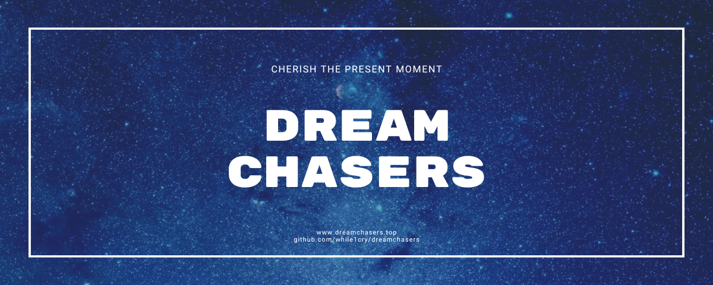

  <h1>DreamChasers-Server（梦想驿站网页端）</h1>
  

## 模块简介

🎈 欢迎来到 DreamChasers-Client 模块！这里包含两个基于 Vue.js 开发的网页前端，用于支持 梦想驿站 和 惜别梦途 的功能。
💻 这两个前端都使用 Node.js 构建，使用 Pinia 进行状态管理，使用 Vue Router 进行路由管理。

## 📜 第三方开源许可证

📝 本模块使用了以下开源软件，它们的版权归原作者所有。

### 1️⃣ Vue.js
- **许可证**: MIT License
- **官网**: [https://cn.vuejs.org/](https://cn.vuejs.org/)
- **说明**: 用于构建网页前端。

### 2️⃣ Pinia
- **许可证**: MIT License
- **官网**: [https://pinia.vuejs.org/](https://pinia.vuejs.org/)
- **说明**: 用于构建网页前端。

### 3️⃣ Vue Router
- **许可证**: MIT License
- **官网**: [https://router.vuejs.org/](https://router.vuejs.org/)
- **说明**: 用于构建网页前端。
